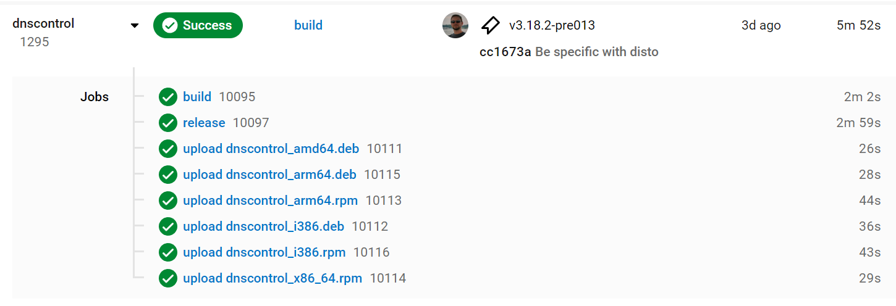

# How to build and ship a release

These are the instructions for producing a release.

CircleCI will do most of the work for you. You will need to edit the draft release notes.

Please change the version number as appropriate.  Substitute (for example)
`3.20.0` any place you see `VERSION` in this doc.

## Step 1. Rebuild generated files

```shell
git checkout master
git pull
go generate
go mod tidy
git add -A
git commit -m "Update generated files for VERSION"
```

This will update the following generated files:

* `docs/_includes/matrix.md`
* `commands/types/dnscontrol.d.ts`

## Step 2. Tag the commit in master that you want to release

```shell
git tag -a v3.20.0
git push origin --tags
```

See [Git Docs](https://git-scm.com/book/en/v2/Git-Basics-Tagging) for more examples.

Soon after
CircleCI will start a [build](https://app.circleci.com/pipelines/github/StackExchange/dnscontrol) Workflow and produce all of the artifacts for the release.



## Step 3. Create the release notes

The draft release notes are created for you. In this step you'll edit them.

The CircleCI build uses [GoReleaser](https://goreleaser.com/) which produces the [GitHub Release](https://github.com/StackExchange/dnscontrol/releases) with Release Notes derived from the commit history between now and the last tag.
These notes are just a draft and needs considerable editing.
You can also find a copy of the release notes in the CircleCI `release` job Artifacts.
These release notes will be used in multiple places (release notes, email announcements, etc.)

Release notes style guide:

* Entries in the bullet list should be phrased in the positive: "Feature FOO now does BAR".  This is often the opposite of the related issue, which was probably phrased, "Feature FOO is broken because of BAR".
* Every item should include the ID of the issue related to the change. If there was no issue, create one and close it.
* Sort the list most important/exciting changes earlier in the list.
* Items related to a specific provider should begin with the all-caps name of the provider, such as "ROUTE53: Added support for sandwiches (#100)"
* The `Deprecation warnings` section should just copy from `README.md`.  If you change one, change it in the README too (you can make that change in this PR).

See [https://github.com/StackExchange/dnscontrol/releases for examples](https://github.com/StackExchange/dnscontrol/releases) for recent release notes and copy that style.

Template:

```text
## Changelog

This release includes many new providers (FILL IN), dozens
of bug fixes, and FILL IN.

### Breaking changes:

* FILL IN

### Major features:

* FILL IN

### Provider-specific changes:

* FILL IN

### Other changes and improvements:

* FILL IN

### Deprecation warnings
```

## Step 4. Announce it via email

Email the release notes to the mailing list: (note the format of the Subject line and that the first line of the email is the URL of the release)

```text
To: dnscontrol-discuss@googlegroups.com
Subject: New release: dnscontrol v$VERSION

https://github.com/StackExchange/dnscontrol/releases/tag/v$VERSION

[insert the release notes here]
```


**NOTE**: You won't be able to post to the mailing list unless you are on
it.  [Click here to join](https://groups.google.com/g/dnscontrol-discuss).


## Step 5. Announce it via chat

Mention on [https://gitter.im/dnscontrol/Lobby](https://gitter.im/dnscontrol/Lobby) that the new release has shipped.

```text
ANNOUNCEMENT: dnscontrol v$VERSION has been released! https://github.com/StackExchange/dnscontrol/releases/tag/v$VERSION
```

## Step 6. Get credit

Mention the fact that you did this release in your weekly accomplishments.

If you are at Stack Overflow:

* Add the release to your weekly snippets
* Run this build: `dnscontrol_embed - Promote most recent artifact into ExternalDNS repo`

## Tip: How to bump the major version

If you bump the major version, you need to change all the source
files.  The last time this was done (v2 -> v3) these two commands
were used. They're included her for reference.

```shell
#  Make all the changes:
sed -i.bak -e 's@github.com.StackExchange.dnscontrol.v2@github.com/StackExchange/dnscontrol/v3@g' go.* $(fgrep -lri --include '*.go' github.com/StackExchange/dnscontrol/v2 *)
# Delete the backup files:
find * -name \*.bak -delete
```

## Tip: Configuring CircleCI integration tests.

### Overview:

CircleCI is configured to run an integration test for any provider listed in the "provider" list. However the test is skipped if the `*_DOMAIN` variable is not set. For example, the GCLOUD provider integration test is only run if `GCLOUD_DOMAIN` is set.

* Q: Where is the list of providers to run integration tests on?
* A: In `.circleci/config.yml` look for the "provider" list:

Example:

```yaml
workflows:
  build:
    jobs:
      - integration-tests:
          matrix:
            parameters:
              provider:
                - GCLOUD
```

* Q: Where are non-secret environment variables stored?
* A: In `.circleci/config.yml` look for:

```yaml
jobs:
  integration-tests:
    environment: # environment variables for the build itself
      GCLOUD_EMAIL: dnscontrol@dnscontrol-dev.iam.gserviceaccount.com
      GCLOUD_PROJECT: dnscontrol-dev
```

* Q: Where are SECRET environment variables stored?
* A: In the project: [project settings / environment variables](https://app.circleci.com/settings/project/github/StackExchange/dnscontrol/environment-variables)

### How do I add a single new integration test?

1. Edit `.circleci/config.yml`
2. Add the name of the provider (ALL CAPS) to the "provider" list.
3. Any non-secret env variables needed? Add them to the "environment" section.
4. Any secrets?  Add them to the [project settings / environment variables](https://app.circleci.com/settings/project/github/StackExchange/dnscontrol/environment-variables)
5. Add the `_DOMAIN` environment variable to [project settings / environment variables](https://app.circleci.com/settings/project/github/StackExchange/dnscontrol/environment-variables). It is not secret, but must be set as part of the project.

### How do I add a "bring your own keys" integration test?

Overview: You will fork the repo and add any secrets to your fork.  For security reasons you won't have access to the secrets from the main repository.

1. [Fork StackExchange/dnscontrol](https://github.com/StackExchange/dnscontrol/fork) in GitHub.

    If you already have a fork, be sure to use the "sync fork" button on the main page to sync with master.

2. Create a CircleCI account

    Go to [circleci.com](https://circleci.com/) and follow the instructions.

3. Set up a CircleCI project

    On the projects page, find "dnscontrol". Click "Set Up Project". Use the "Fastest" method (use the existing `.circleci/config.yml` file).

    If you get the error message below, go to the "Organization Settings" (left nav). Then "Security" (left nav) and set "Allow Uncertified Orbs" under "Orb Security Settings" to "Yes".

    >"Orb cloudsmith/cloudsmith@1.0.5 not loaded. To use this orb, an organization admin must opt-in to using third party orbs in Organization Security settings."

4. Add the secret env variables:

    Go to Project Settings (for this project), and "Environment Variables".

   * Add env variable `provider_DOMAIN`  where "provider" is the all caps name of the provider. For example add `BIND_DOMAIN` with the value "example.com"

5. Start a build

    From the pipelnies page, you can trigger a build by setting the branch to "master" then click "trigger".

    Merges to "master" result in the software being built.  Merges to any other branch causes integration tests to run.

    Verify that your tests are working properly by making a branch.  You'll see on the `Run integration tests for _____ provider` step the results of the test.

    Some notes:

   * Tests that are skipped take about 3 seconds to complete. In other words, if you look at a list of tests, you can tell which ones were skipped by looking at the completion time.
   * Free accounts don't have access to `2xlarge` instanace. You'll either need to upgrade your CircleCI account or change `2xlarge` to `large` in `.circleci/config.yml` in your fork. Please be careful to not include that file when you send a PR. See [#1935](https://github.com/StackExchange/dnscontrol/issues/1935) (Anyone have tips on how to make that easier?)

## Tip: How to rebuild flattener

Rebuilding flatter requites go1.17.1 and the gopherjs compiler.

Install go1.17.1:

```shell
go install golang.org/dl/go1.17.1@latest
go1.17.1 download
```

Install gopherjs:

```shell
go install github.com/gopherjs/gopherjs@latest
```

Build the software:


**NOTE**: GOOS can't be Darwin because GOPHERJS doesn't support it.


```shell
cd docs/flattener
export GOPHERJS_GOROOT="$(go1.17.1 env GOROOT)"
export GOOS=linux
gopherjs build
```

## Tip: How to update modules

List out-of-date modules and update any that seem worth updating:

```shell
go install github.com/oligot/go-mod-upgrade@latest
go-mod-upgrade
go mod tidy
```

OLD WAY:

```shell
go install github.com/psampaz/go-mod-outdated@latest
go list -mod=mod -u -m -json all | go-mod-outdated -update -direct

# If any are out of date, update via:

go get module/path

# Once the updates are complete, tidy up:

go mod tidy
```
