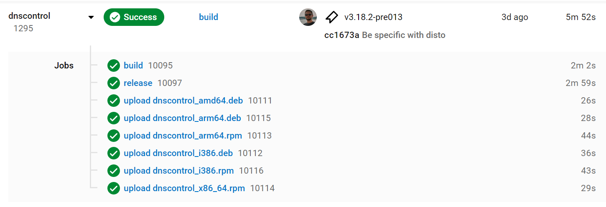

# How to build and ship a release

These are the instructions for producing a release.

CircleCI will do most of the work for you. You will need to edit the draft release notes.

Please change the version number as appropriate.  Substitute (for example)
`3.20.0` any place you see `VERSION` in this doc.

## Step 1. Tag the commit in master that you want to release

```shell
git checkout master
git tag -a v3.20.0
git push origin --tags
```

See [Git Docs](https://git-scm.com/book/en/v2/Git-Basics-Tagging) for more examples.

Soon after
CircleCI will start a [build](https://app.circleci.com/pipelines/github/StackExchange/dnscontrol) Workflow and produce all of the artifacts for the release.



## Step 2. Create the release notes

The draft release notes are created for you. In this step you'll edit them.

The CircleCI build uses [GoReleaser](https://goreleaser.com/) which produces the [GitHub Release](https://github.com/StackExchange/dnscontrol/releases) with Release Notes derived from the commit history between now and the last tag.
These notes are just a draft and needs considerable editing.
You can also find a copy of the release notes in the CircleCI `release` job Artifacts.
These release notes will be used in multiple places (release notes, email announcements, etc.)

Release notes style guide:

* Entries in the bullet list should be phrased in the positive: "Feature FOO now does BAR".  This is often the opposite of the related issue, which was probably phrased, "Feature FOO is broken because of BAR".
* Every item should include the ID of the issue related to the change. If there was no issue, create one and close it.
* Sort the list most important/exciting changes earlier in the list.
* Items related to a specific provier should begin with the all-caps name of the provider, such as "ROUTE53: Added support for sandwiches (#100)"
* The `Depreciation warnings` section should just copy from `README.md`.  If you change one, change it in the README too (you can make that change in this PR).

See [https://github.com/StackExchange/dnscontrol/releases for examples](https://github.com/StackExchange/dnscontrol/releases) for recent release notes and copy that style.

Template:

```text
## Changelog

This release includes many new providers (FILL IN), dozens
of bug fixes, and FILL IN.

### Breaking changes:

* FILL IN

### Major features:

* FILL IN

### Provider-specific changes:

* FILL IN

### Other changes and improvements:

* FILL IN

### Depreciation warnings
```

## Step 2. Announce it via email

Email the release notes to the mailing list: (note the format of the Subject line and that the first line of the email is the URL of the release)

```text
To: dnscontrol-discuss@googlegroups.com
Subject: New release: dnscontrol v$VERSION

https://github.com/StackExchange/dnscontrol/releases/tag/v$VERSION

[insert the release notes here]
```

NOTE: You won't be able to post to the mailing list unless you are on
it.  [Click here to join](https://groups.google.com/forum/#!forum/dnscontrol-discuss).

## Step 3. Announce it via chat

Mention on [https://gitter.im/dnscontrol/Lobby](https://gitter.im/dnscontrol/Lobby) that the new release has shipped.

```text
ANNOUNCEMENT: dnscontrol v$VERSION has been released! https://github.com/StackExchange/dnscontrol/releases/tag/v$VERSION
```

## Step 4. Get credit

Mention the fact that you did this release in your weekly accomplishments.

If you are at Stack Overflow:

* Add the release to your weekly snippets
* Run this build: `dnscontrol_embed - Promote most recent artifact into ExternalDNS repo`

## Tip: How to bump the major version

If you bump the major version, you need to change all the source
files.  The last time this was done (v2 -> v3) these two commands
were used. They're included her for reference.

```bash
#  Make all the changes:
sed -i.bak -e 's@github.com.StackExchange.dnscontrol.v2@github.com/StackExchange/dnscontrol/v3@g' go.* $(fgrep -lri --include '*.go' github.com/StackExchange/dnscontrol/v2 *)
# Delete the backup files:
find * -name \*.bak -delete
```

## Tip: How to rebuild flattener

Rebuilding flatter requites go1.17.1 and the gopherjs compiler.

Install go1.17.1:

```shell
go install golang.org/dl/go1.17.1@latest
go1.17.1 download
```

Install gopherjs:

```shell
go install github.com/gopherjs/gopherjs@latest
```

Build the software:

NOTE: GOOS can't be Darwin because GOPHERJS doesn't support it.

```shell
cd docs/flattener
export GOPHERJS_GOROOT="$(go1.17.1 env GOROOT)"
export GOOS=linux
gopherjs build
```

## Tip: How to update modules

List out-of-date modules and update any that seem worth updating:

```bash
go install github.com/oligot/go-mod-upgrade@latest
go-mod-upgrade
go mod tidy
```

OLD WAY:

```bash
go install github.com/psampaz/go-mod-outdated@latest
go list -mod=mod -u -m -json all | go-mod-outdated -update -direct

# If any are out of date, update via:

go get module/path

# Once the updates are complete, tidy up:

go mod tidy
```
