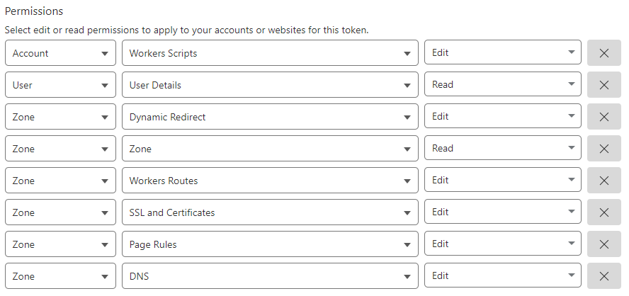

This is the provider for [Cloudflare](https://www.cloudflare.com/).

## Important notes

* SPF records are silently converted to RecordType `TXT` as Cloudflare API fails otherwise. See [StackExchange/dnscontrol#446](https://github.com/StackExchange/dnscontrol/issues/446).
* This provider currently fails if there are more than 1000 corrections on one domain. This only affects "push". This usually when moving a domain with many records to Cloudflare.  Try commenting out most records, then uncomment groups of 999. Typical updates are less than 1000 corrections and will not trigger this bug. See [StackExchange/dnscontrol#1440](https://github.com/StackExchange/dnscontrol/issues/1440).

## Configuration

To use this provider, add an entry to `creds.json` with `TYPE` set to `CLOUDFLAREAPI`.

Optional fields include:

* `accountid` and `apitoken`: Authentication information
* `apikey` and `apiuser`: Old-style authentication

Example:


```json
{
  "cloudflare": {
    "TYPE": "CLOUDFLAREAPI",
    "accountid": "your-cloudflare-account-id",
    "apitoken": "your-cloudflare-api-token"
  }
}
```


# Authentication

The Cloudflare API supports two different authentication methods.

NOTE: You can not mix the two authentication methods.  If you try, DNSControl will report an error.

## API Tokens (recommended)

The recommended (newer) method is to
provide a [Cloudflare API token](https://dash.cloudflare.com/profile/api-tokens).

This method is enabled by setting the `apitoken` value in `creds.json`:


```json
{
  "cloudflare": {
    "TYPE": "CLOUDFLAREAPI",
    "accountid": "your-cloudflare-account-id",
    "apitoken": "your-cloudflare-api-token"
  }
}
```


* `accountid` is found in the Cloudflare portal ("Account ID") on any "Website" page.  Click on any site and you'll see the "Account ID" on the lower right side of the page.
* `apitoken` is something you must create. See [Cloudflare's documentation](https://developers.cloudflare.com/fundamentals/api/get-started/create-token/) for instructions on how to generate and configure permissions on API tokens.  (Spoiler alert: [link](https://dash.cloudflare.com/profile/api-tokens). The token must be granted rights (authorization to do certain tasks) at a very granular level.

DNSControl requires the token to have the following permissions:

* Add: Read zones (`Zone → Zone → Read`)
* Add: Edit DNS records (`Zone → DNS → Edit`)
* Add: Enable SSL controls (`Zone → SSL and Certificates → Edit`)
* Editing Page Rules?
  * Add: Edit Page Rules (`Zone → Page Rules → Edit`)
* Creating Redirects?
  * Add: Edit Single Redirect (`Zone → Single Redirect → Edit`)
* Managing Cloudflare Workers? (if `manage_workers`: set to `true` or `CF_WORKER_ROUTE()` is in use.)
  * Add: Edit Worker Scripts (`Account → Workers Scripts → Edit`)
  * Add: Edit Worker Scripts (`Zone → Workers Routes → Edit`)



## Username+Key (not recommended)

The other (older, not recommended) method is to
provide your Cloudflare API username and access key.

This method is not recommended because these credentials give DNSControl access to everything (think of it as "super user" for your account).

This method is enabled by setting the `apikey` and `apiuser` values in `creds.json`:


```json
{
  "cloudflare": {
    "TYPE": "CLOUDFLAREAPI",
    "accountid": "your-cloudflare-account-id",
    "apikey": "your-cloudflare-api-key",
    "apiuser": "your-cloudflare-email-address"
  }
}
```


* `accountid` (see above)
* `apiuser` is the email address associated with the account.
* `apikey` is found on [My Profile / API Tokens](https://dash.cloudflare.com/profile/api-tokens).

## Meta configuration

This provider accepts some optional metadata:

Record level metadata available:
   * `cloudflare_proxy` ("on", "off", or "full")
   * `cloudflare_cname_flatten` ("on" or "off") - Per-record CNAME flattening (paid plans only)
   * `cloudflare_comment` - Record comment (requires `CF_MANAGE_COMMENTS` on domain)
   * `cloudflare_tags` - Comma-separated tags (requires `CF_MANAGE_TAGS` on domain, paid plans only)

Domain level metadata available:
   * `cloudflare_proxy_default` ("on", "off", or "full")
   * `cloudflare_universalssl` (unset to leave this setting unmanaged; otherwise use "on" or "off")
     * NOTE: If "universal SSL" isn't working, verify the API key has `Zone → SSL and Certificates → Edit` permissions. See above.
   * `cloudflare_manage_comments` ("true") - Opt-in to managing record comments
   * `cloudflare_manage_tags` ("true") - Opt-in to managing record tags (paid plans only)

Provider level metadata available:
   * `ip_conversions`
   * `manage_redirects`: set to `true` to manage page-rule based redirects
   * `manage_workers`: set to `true` to manage cloud workers (`CF_WORKER_ROUTE`)

What does on/off/full mean?

   * "off" disables the Cloudflare proxy
   * "on" enables the Cloudflare proxy (turns on the "orange cloud")
   * "full" is the same as "on" but also enables Railgun.  DNSControl will prevent you from accidentally enabling "full" on a CNAME that points to an A record that is set to "off", as this is generally not desired.

You can also set the default proxy mode using `DEFAULTS()` function. For example:


```javascript
DEFAULTS(
  CF_PROXY_DEFAULT_OFF // turn proxy off when not specified otherwise
);
```


**Aliases:**

To make configuration files more readable and less prone to errors,
the following aliases are *pre-defined*:


```javascript
// Meta settings for individual records.
var CF_PROXY_OFF = {"cloudflare_proxy": "off"};     // Proxy disabled.
var CF_PROXY_ON = {"cloudflare_proxy": "on"};       // Proxy enabled.
var CF_PROXY_FULL = {"cloudflare_proxy": "full"};   // Proxy+Railgun enabled.
var CF_CNAME_FLATTEN_OFF = {"cloudflare_cname_flatten": "off"};  // CNAME flattening disabled (default).
var CF_CNAME_FLATTEN_ON = {"cloudflare_cname_flatten": "on"};    // CNAME flattening enabled (paid plans only).
// CF_COMMENT(comment) - Set a comment on a record (requires CF_MANAGE_COMMENTS).
// CF_TAGS(tag1, tag2, ...) - Set tags on a record (requires CF_MANAGE_TAGS, paid plans only).

// Per-domain meta settings:
// Proxy default off for entire domain (the default):
var CF_PROXY_DEFAULT_OFF = {"cloudflare_proxy_default": "off"};
// Proxy default on for entire domain:
var CF_PROXY_DEFAULT_ON = {"cloudflare_proxy_default": "on"};
// UniversalSSL off for entire domain:
var CF_UNIVERSALSSL_OFF = { cloudflare_universalssl: "off" };
// UniversalSSL on for entire domain:
var CF_UNIVERSALSSL_ON = { cloudflare_universalssl: "on" };
// Enable comment management for domain (opt-in):
var CF_MANAGE_COMMENTS = { cloudflare_manage_comments: "true" };
// Enable tag management for domain (opt-in, paid plans only):
var CF_MANAGE_TAGS = { cloudflare_manage_tags: "true" };
```


The following example shows how to set meta variables with and without aliases:


```javascript
var REG_NONE = NewRegistrar("none");
var DSP_CLOUDFLARE = NewDnsProvider("cloudflare");

D("example.com", REG_NONE, DnsProvider(DSP_CLOUDFLARE),
    A("www1","1.2.3.11", CF_PROXY_ON),        // turn proxy ON.
    A("www2","1.2.3.12", CF_PROXY_OFF),       // default is OFF, this is a no-op.
    A("www3","1.2.3.13", {"cloudflare_proxy": "on"}), // Old format.
);
```


## Usage
An example configuration:


```javascript
var REG_NONE = NewRegistrar("none");
var DSP_CLOUDFLARE = NewDnsProvider("cloudflare");

// Example domain where the CF proxy abides by the default (off).
D("example.com", REG_NONE, DnsProvider(DSP_CLOUDFLARE),
    A("proxied", "1.2.3.4", CF_PROXY_ON),
    A("notproxied", "1.2.3.5"),
    A("another", "1.2.3.6", CF_PROXY_ON),
    ALIAS("@", "www.example.com.", CF_PROXY_ON),
    CNAME("myalias", "www.example.com.", CF_PROXY_ON),
);

// Example domain where the CF proxy default is set to "on":
D("example2.tld", REG_NONE, DnsProvider(DSP_CLOUDFLARE),
    CF_PROXY_DEFAULT_ON, // Enable CF proxy for all items unless otherwise noted.
    A("proxied", "1.2.3.4"),
    A("notproxied", "1.2.3.5", CF_PROXY_OFF),
    A("another", "1.2.3.6"),
    ALIAS("@", "www.example2.tld."),
    CNAME("myalias", "www.example2.tld."),
);
```


## New domains
If a domain does not exist in your Cloudflare account, DNSControl
will automatically add it when `dnscontrol push` is executed.

## CNAME flattening

Cloudflare supports [CNAME flattening](https://developers.cloudflare.com/dns/cname-flattening/), which resolves CNAME targets to their IP addresses at the edge. This can be enabled zone-wide (for zones on paid Cloudflare plans) or per-record.

DNSControl supports per-record CNAME flattening using the `CF_CNAME_FLATTEN_ON` modifier:


```javascript
var REG_NONE = NewRegistrar("none");
var DSP_CLOUDFLARE = NewDnsProvider("cloudflare");

D("example.com", REG_NONE, DnsProvider(DSP_CLOUDFLARE),
    // Enable CNAME flattening for this record
    CNAME("cdn", "cdn.provider.com.", CF_CNAME_FLATTEN_ON),

    // CNAME flattening disabled (default behavior)
    CNAME("www", "www.example.com."),
    CNAME("api", "api.example.com.", CF_CNAME_FLATTEN_OFF),
);
```



**Paid plans only:** Per-record CNAME flattening requires a Cloudflare paid subscription (Pro, Business, or Enterprise). Free plans do not support this feature. If you attempt to enable CNAME flattening on a free zone, the Cloudflare API will return an error.


For more information, see [Cloudflare's CNAME flattening documentation](https://developers.cloudflare.com/dns/cname-flattening/).

## Record comments and tags

Cloudflare supports adding comments and tags to DNS records. Comments are free-text notes visible in the Cloudflare dashboard. Tags are labels that can be used for filtering and organization.

### Enabling comment/tag management

By default, DNSControl does not manage comments or tags. This is an opt-in feature because:

1. You may have existing comments/tags on records that are not in your `dnsconfig.js`
2. Enabling management without defining comments/tags would wipe out existing ones

To enable management, add the appropriate domain modifier:


```javascript
var REG_NONE = NewRegistrar("none");
var DSP_CLOUDFLARE = NewDnsProvider("cloudflare");

D("example.com", REG_NONE, DnsProvider(DSP_CLOUDFLARE),
    CF_MANAGE_COMMENTS,  // Enable comment management for this domain
    CF_MANAGE_TAGS,      // Enable tag management for this domain (paid plans only)

    A("www", "1.2.3.4", CF_COMMENT("Production web server")),
    A("api", "1.2.3.5", CF_TAGS("production", "api"), CF_COMMENT("API endpoint")),
);
```


### Using comments

Comments work on all Cloudflare plans (including free). Use `CF_COMMENT()` to add a comment to any record:


```javascript
D("example.com", REG_NONE, DnsProvider(DSP_CLOUDFLARE),
    CF_MANAGE_COMMENTS,

    A("www", "1.2.3.4", CF_COMMENT("Main website - hosted on AWS")),
    A("mail", "1.2.3.5", CF_COMMENT("Mail server")),
    MX("@", 10, "mail.example.com.", CF_COMMENT("Primary MX")),
);
```



If you use `CF_COMMENT()` without enabling `CF_MANAGE_COMMENTS`, DNSControl will return an error. This prevents accidentally ignoring your comments.


### Using tags

Tags require a paid Cloudflare plan (Pro, Business, or Enterprise). Use `CF_TAGS()` to add one or more tags to a record.

Tags can be either:
- A simple word: `"production"`, `"web"`, `"critical"`
- A key:value pair: `"env:production"`, `"team:platform"`, `"cost-center:12345"`

In the Cloudflare Dashboard, you can filter DNS records by the presence of a tag or by a specific tag value.


```javascript
D("example.com", REG_NONE, DnsProvider(DSP_CLOUDFLARE),
    CF_MANAGE_TAGS,

    // Simple tags
    A("www", "1.2.3.4", CF_TAGS("production", "web")),
    A("staging", "1.2.3.6", CF_TAGS("staging", "web")),

    // Key:value tags
    A("api", "1.2.3.5", CF_TAGS("env:production", "team:api", "critical")),
);
```



**Paid plans only:** Tags require a Cloudflare paid subscription. Free plans do not support this feature.



Tags cannot use the reserved `cf-` prefix. Cloudflare reserves this prefix for internal use.



If you use `CF_TAGS()` without enabling `CF_MANAGE_TAGS`, DNSControl will return an error.


For more information, see [Cloudflare's documentation on DNS record comments and tags](https://developers.cloudflare.com/dns/manage-dns-records/reference/record-attributes/).

### Combining comments and tags

You can use both comments and tags on the same record:


```javascript
D("example.com", REG_NONE, DnsProvider(DSP_CLOUDFLARE),
    CF_MANAGE_COMMENTS,
    CF_MANAGE_TAGS,

    A("api", "1.2.3.5",
        CF_COMMENT("Production API endpoint - contact: api-team@example.com"),
        CF_TAGS("production", "api", "critical")
    ),
);
```


### Viewing existing comments and tags

The `get-zones` command will always display any comments or tags found on records, regardless of whether management is enabled. This helps you see what's currently set before enabling management:

```shell
dnscontrol get-zones --format=js cloudflare CLOUDFLAREAPI example.com
```

### Aliases

The following aliases are pre-defined:


```javascript
// Domain modifiers (opt-in to management):
var CF_MANAGE_COMMENTS = {"cloudflare_manage_comments": "true"};
var CF_MANAGE_TAGS = {"cloudflare_manage_tags": "true"};

// Record modifiers:
// CF_COMMENT(comment) - Set a comment on a record
// CF_TAGS(tag1, tag2, ...) - Set tags on a record
```


## Old-style vs new-style redirects

Old-style redirects uses the [Page Rules](https://developers.cloudflare.com/rules/page-rules/) product feature, which is [going away](https://developers.cloudflare.com/rules/reference/page-rules-migration/).  In this mode,
`CF_REDIRECT` and `CF_TEMP_REDIRECT` functions generate Page Rules.

Enable it using:

```javascript
var DSP_CLOUDFLARE = NewDnsProvider("cloudflare", {
    "manage_redirects": true,
    "transcode_log": "transcode.log",
});
```

New redirects uses the [Single Redirects](https://developers.cloudflare.com/rules/url-forwarding/) product feature.  In this mode,
`CF_REDIRECT` and `CF_TEMP_REDIRECT` functions generates Single Redirects.

Enable it using:

```javascript
var DSP_CLOUDFLARE = NewDnsProvider("cloudflare", {
    "manage_single_redirects": true
});
```


New-style redirects ("Single Redirect Rules") are a new feature of DNSControl
as of v4.12.0 and may have bugs.  Please test carefully.


### Conversion mode:

DNSControl can convert from old-style redirects (Page Rules) to new-style
redirect (Single Redirects). To enable this mode, set both `manage_redirects`
and `manage_single_redirects` to true.


The conversion process only handles a few, very simple, patterns.
See `providers/cloudflare/rtypes/cfsingleredirect/convert_test.go` for a list of patterns
supported.  Please file bugs if you find problems. PRs welcome!


In conversion mode, DNSControl takes `CF_REDIRECT`/`CF_TEMP_REDIRECT`
statements and turns each of them into two records: a Page Rules and an
equivalent Single Redirects rule.

Cloudflare processes Single Redirects before Page Rules, thus it is safe to
have both at the same time, and provides an easy way to test the new-style
rules.  If they do not work properly, use the Cloudflare web-based control
panel to manually delete the new-style rule to expose the old-style rule. (and
report the bug to DNSControl!)

You'll find the new-style rule in the Cloudflare control panel.  It will have
a very long name that includes the `CF_REDIRECT`/`CF_TEMP_REDIRECT` operands
plus matcher and replacement expressions.

There is no mechanism to easily delete the old-style rules.  Either delete them
manually using the Cloudflare control panel or wait for Cloudflare to remove
the old-style Page Rule feature.

Once the conversion is complete, change
`manage_redirects` to `false` then either delete the old redirects
via the CloudFlare control panel or wait for Cloudflare to remove support for the old-style feature.


Cloudflare's announcement says that they will convert old-style redirects (Page Rules) to new-style
redirect (Single Redirects) but they do not give an exact date for when this will happen.  DNSControl
will probably see these new redirects as foreign and delete them.

Therefore it is probably safer to do the conversion ahead of them.

On the other hand, if you let them do the conversion, their conversion may be more correct
than DNSControl's.  However there's no way for DNSControl to manage them since the automatically-generated name will be different.

If you have suggestions on how to handle this better please file a bug.


### Converting to CF_SINGLE_REDIRECT permanently

DNSControl will help convert `CF_REDIRECT`/`CF_TEMP_REDIRECT` statements into
`CF_SINGLE_REDIRECT` statements. You might choose to do this if you do not want
to rely on the automatic translation, or if you want to edit the results of the
translation.

DNSControl will generate a file of the translated statements if you specify
a filename using the `transcode_log` meta option.

```javascript
var DSP_CLOUDFLARE = NewDnsProvider("cloudflare", {
    "manage_single_redirects": true,
    "transcode_log": "transcode.log",
});
```

After running `dnscontrol preview` the contents will look something like this:


```text
D("example.com", ...
    CF_SINGLE_REDIRECT("1,302,https://example.com/*,https://replacement.example.com/$1",
                       302,
                       'http.host eq "example.com"',
                       'concat("https://replacement.example.com", http.request.uri.path)'
    ),
    CF_SINGLE_REDIRECT("2,302,https://img.example.com/*,https://replacement.example.com/$1",
                       302,
                       'http.host eq "img.example.com"',
                       'concat("https://replacement.example.com", http.request.uri.path)'
    ),
    CF_SINGLE_REDIRECT("3,302,https://i.example.com/*,https://replacement.example.com/$1",
                       302,
                       'http.host eq "i.example.com"',
                       'concat("https://replacement.example.com", http.request.uri.path)'
    ),
D("otherdomain.com", ...
    CF_SINGLE_REDIRECT("1,301,https://one.otherdomain.com/,https://www.google.com/",
                       301,
                       'http.host eq "one.otherdomain.com" and http.request.uri.path eq "/"',
                       'concat("https://www.google.com/", "")'
    ),
```


Copying the statements to the proper place in `dnsconfig.js` is manual.


## Redirects
The Cloudflare provider can manage "Forwarding URL" Page Rules (redirects) for your domains. Simply use the `CF_REDIRECT` and `CF_TEMP_REDIRECT` functions to make redirects:


```javascript
// chiphacker.com should redirect to electronics.stackexchange.com

var REG_NONE = NewRegistrar("none");
var DSP_CLOUDFLARE = NewDnsProvider("cloudflare", {"manage_redirects": true}); // enable manage_redirects

D("chiphacker.com", REG_NONE, DnsProvider(DSP_CLOUDFLARE),
    // ...

    // 302 for meta subdomain
    CF_TEMP_REDIRECT("meta.chiphacker.com/*", "https://electronics.meta.stackexchange.com/$1"),

    // 301 all subdomains and preserve path
    CF_REDIRECT("*chiphacker.com/*", "https://electronics.stackexchange.com/$2"),

    // A redirect must have A records with orange cloud on. Otherwise the HTTP/HTTPS request will never arrive at Cloudflare.
    A("meta", "1.2.3.4", CF_PROXY_ON),

    // ...
);
```


Notice a few details:

1. We need an A record with cloudflare proxy on, or the page rule will never run.
2. The IP address in those A records may be mostly irrelevant, as cloudflare should handle all requests (assuming some page rule matches).
3. Ordering matters for priority. CF_REDIRECT records will be added in the order they appear in your js. So put catch-alls at the bottom.
4. if _any_ `CF_REDIRECT` or `CF_TEMP_REDIRECT` functions are used then `dnscontrol` will manage _all_ "Forwarding URL" type Page Rules for the domain. Page Rule types other than "Forwarding URL" will be left alone. In other words, `dnscontrol` will delete any Forwarding URL it doesn't recognize. Be careful!

## Worker routes
The Cloudflare provider can manage Worker Routes for your domains. Simply use the `CF_WORKER_ROUTE` function passing the route pattern and the worker name:


```javascript
var REG_NONE = NewRegistrar("none");
var DSP_CLOUDFLARE = NewDnsProvider("cloudflare", {"manage_workers": true}); // enable managing worker routes

D("foo.com", REG_NONE, DnsProvider(DSP_CLOUDFLARE),
    // Assign the patterns `api.foo.com/*` and `foo.com/api/*` to `my-worker` script.
    CF_WORKER_ROUTE("api.foo.com/*", "my-worker"),
    CF_WORKER_ROUTE("foo.com/api/*", "my-worker"),
);
```


The API key you use must be enabled to edit workers.  In the portal, edit the API key,
under "Permissions" add "Account", "Workers Scripts", "Edit". Without this permission you may see errors that mention "failed fetching worker route list from cloudflare: bad status code from cloudflare: 403 not 200"

Please notice that if _any_ `CF_WORKER_ROUTE` function is used then `dnscontrol` will manage _all_
Worker Routes for the domain. To be clear: this means it will delete existing routes that
were created outside of DNSControl.

## DS records

Cloudflare has restrictions that may result in DNSControl's attempt to insert
DS records to fail.

## TXT records

Do you see this warning in the Cloudflare dashboard?

> "The content field of TXT records must be in quotation marks. Cloudflare may
> add quotation marks on your behalf, which will not affect how the record
> works."


TXT records created/updated by DNSControl v4.31.1 and prior will produce this warning. It is meaningless and should be ignored.

If you are unable to ignore the warning, any of these will remove it:

* In the Cloudflare dashboard, click to edit the record and immediately save it. As of 2026-01-21, Cloudflare's UI can fix the issue, not just complain about it.
* Force DNSControl to update the record. Either change it (make an inconsequential change), or delete the TXT record and allow DNSControl to recreate it.

## Integration testing

The integration tests assume that Cloudflare Workers are enabled and the credentials used
have the required permissions listed above.  The flag `-cfworkers=false` will disable tests related to Workers.
This flag is intended for use with legacy domains where the integration test credentials do not
have access to read/edit Workers. This flag will eventually go away.

```shell
cd integrationTest              # NOTE: Not needed if already in that subdirectory
go test -v -verbose -profile CLOUDFLAREAPI -cfworkers=false
```

When `-cfworkers=false` is set, tests related to Workers are skipped.  The Account ID is not required.

### CNAME flattening tests

Tests for per-record CNAME flattening (`CF_CNAME_FLATTEN_ON`/`CF_CNAME_FLATTEN_OFF`) are disabled by default
because they require a paid Cloudflare plan. To enable these tests, use the `-cfflatten=true` flag:

```shell
cd integrationTest
go test -v -verbose -profile CLOUDFLAREAPI -cfflatten=true
```

If you run with `-cfflatten=true` on a free zone, the tests will fail with an error from the Cloudflare API.

### Tag tests

Tests for record comments (`CF_COMMENT`) always run since comments work on all plans.
Tests for record tags (`CF_TAGS`) are disabled by default because they require a paid plan.

```shell
cd integrationTest
# Tags disabled by default:
go test -v -verbose -profile CLOUDFLAREAPI

# Enable tag tests (requires paid plan):
go test -v -verbose -profile CLOUDFLAREAPI -cftags=true

# Enable all paid features:
go test -v -verbose -profile CLOUDFLAREAPI -cfflatten=true -cftags=true
```

## Cloudflare special TTLs

Cloudflare plays tricks with TTLs.  Cloudflare uses "1" to mean "auto-ttl";
which as far as we can tell means 300 seconds (5 minutes) with the option that
CloudFlare may dynamically adjust the actual TTL.

If the TTL isn't set to 1, Cloudflare has a minimum of 1 minutes.

A TTL of 0 tells DNSControl to use the default TTL for that provider, which is 1.

In summary:
* TTL of 0 and 1 are the same ("auto TTL").
* TTL of 2-60 are all the same as 60.
* TTL of 61 to infinity is not magic.

Some of this is documented on the Cloudflare website's [Time to Live (TTL)](https://developers.cloudflare.com/dns/manage-dns-records/reference/ttl/) page.
