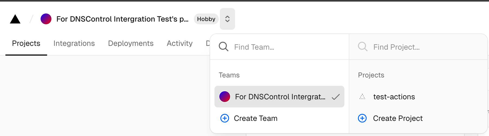
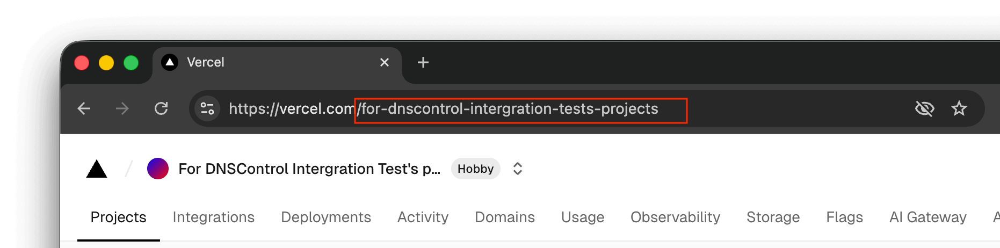

## Configuration

To use this provider, add an entry to `creds.json` with `TYPE` set to `VERCEL`
along with a [Vercel API Token](https://vercel.com/account/settings/tokens) and your team ID.

Example:


```json
{
  "vercel": {
    "TYPE": "VERCEL",
    "team_id": "$VERCEL_TEAM_ID",
    "api_token": "$VERCEL_API_TOKEN"
  }
}
```


**API Token**

You can create a Vercel API Token via [Vercel Account Settings - Tokens](https://vercel.com/account/settings/tokens).

**How to grab team ID**

Log in to your Vercel account and navigate to `https://vercel.com`. Switch to your desired team with the Vercel team switcher if needed.



Now you can find your team ID in your browser's address bar, copy the path (**without** any leading `/` or trailing `/`) and paste it into your `creds.json` file's `team_id` field.



If you are familiar with the Vercel API, you can also grab your team ID via Vercel's [Teams - List all teams API](https://vercel.com/docs/rest-api/reference/endpoints/teams/list-all-teams). In response's `id` field you will able to see a string starts with `team_`, and in response's `slug` field you will able to see a string consists of a slugified version of your team name. Both `id` and `slug` can be used as `team_id` for your `creds.json`.

**Legacy Vercel Account Domains**

If you are an early Vercel user (when Vercel didn't implement teams back then), the domains you added back then might not be migrated to your personal team. You will be able to find and manage those domains in Vercel's [Account Settings - Overview - Domains](https://vercel.com/account/domains).

In this case, you should use an empty string as the team ID:


```json
{
  "vercel": {
    "TYPE": "VERCEL",
    "team_id": ""
  }
}
```


It is possible to manually migrate your domains from your Vercel account to your personal team via the link mentioned above. Whether you choose to migrate your domains or not is up to you, this provider supports both scenarios.

## Usage

An example configuration:


```javascript
var REG_NONE = NewRegistrar("none");
var DSP_VERCEL = NewDnsProvider("vercel");

D("example.com", REG_NONE, DnsProvider(DSP_VERCEL),
    A("test", "1.2.3.4"),
);
```


## Caveats

### New domains

We do not support adding a domain to Vercel via `dnscontrol push`, as Vercel now requires a domain be associated with a project before it can utilize Vercel's DNS. You should use Vercel's [DNS Dashboard](https://vercel.com/dashboard/domains) to add a domain.

### System-managed Records

Vercel will create "system-managed records" for you when you add a domain to Vercel. Those records can not be deleted or modified.

You can add your own records and Vercel will prefer your created records over their system-managed records, but the system-managed records will always be present even if you add your own "override" records.

As of November 2025, the known system-managed records are:

- `CAA 0 issue "letsencrypt.org"`
  - Vercel uses Let's Encrypt to issue certificates for your project deployed on Vercel, thus Vercel automatically creates a CAA record to ensure Let's Encrypt can issue certificates, but you can always add your own CAA records (you can even add your own `letsencrypt.org` CAA record and Vercel will dedupe that).
- `CNAME cname.vercel-dns.com.`
  - Vercel always add a CNAME record to point your deployed project to their infrastructure, but you can always add your own A/AAAA/ALIAS/CNAME records (which allows you to put a third-party CDN in front of Vercel's infrastructure), and Vercel will always prefer your records over their default CNAME.

In Vercel's API, those system-managed records will have their `creator` set to `system`. We use this to identify and ignore system-managed records, to prevent DNSControl from interfering with them. You won't see them in `dnscontrol preview` or `dnscontrol get-zone`.

### Comment

This provider does not recognize Vercel DNS record comment. And we encourage you not to use it. You should use JavaScript comment in your `dnsconfig.js` instead.

In the future, we might use the comment field to store additional metadata for other purposes.

### CAA

As of November 2025, Vercel has a bug that does not accept CAA records with any extra fields that are not `cansigncansignhttpexchanges`:

```
# OK
CAA 0 issue "letsencrypt.org"
CAA 0 issuewild "letsencrypt.org"
CAA 0 issue "digicert.com; cansignhttpexchanges=yes"

# Panic
CAA 0 issue "letsencrypt.org; validationmethods=dns-01"
CAA 0 issue "letsencrypt.org; accounturi=https://acme-v02.api.letsencrypt.org/acme/acct/1234"
```

This is most likely a bug on Vercel's side where Vercel misinterprets other fields as `cansignhttpexchanges`, as the API error response implies:

```
invalid_value - Unexpected "cansignhttpexchanges" value.
```

### Rate Limiting

Vercel is rate limiting requests somewhat heavily. Some of the rate limit and remaining quota is advertised in the API response headers (`x-ratelimit-limit`, `x-ratelimit-remaining`, and `x-ratelimit-reset`), some of HTTP 429 contains the `retry-after` response header, some of the rate limit rules can be found in [Vercel's API documentation](https://vercel.com/docs/limits#rate-limits).

So far, the known rate limit rules are:

- create up to 100 dns records per hour (3600 seconds)
- update up to 50 dns records per minutes (60 seconds)

The rate limit rules for the following actions are unknown:

- list dns records - we assume 50 page per minute (60 seconds)
- delete dns records - we assume 50 dns records per minute (60 seconds)

All operations do not share rate limit quota, each operation has its own rate limit quota.

We will burst through half of the quota, and then it spreads the requests evenly throughout the remaining window. This allows you to move fast and be able to revert accidental changes to the DNS config in a somewhat timely manner. We will retry rate-limited requests (status 429) and respect the advertised `Retry-After` delay.

If you are mass migrating your DNS records from another provider to Vercel, we recommended to upload a BIND zone file via [Vercel's DNS Dashboard](https://vercel.com/dashboard/domains). You can use DNSControl to manage your DNS records afterwards.

> This provider does not utilize that feature, as "upload a BIND zone file" is not documented and is not part of Vercel's public API.

### Change Record Type

Vercel does not allow the record type to be changed after creation. If you try to update a record with a different type (e.g. changing `A` to `CNAME/ALIAS`), we will delete the old record and create a new one. This will count as two separate requests, which may exceed the rate limit. Also be careful about the downtime caused by the deletion and creation of records.

### Minimum TTL

Vercel enforces a minimum TTL of 60 seconds (1 minute) for all records. We will always silently override the TTL to 60 seconds if you try to set a lower TTL.

### HTTPS Record ECH Base64 Validation

Currently, Vercel does implements IETF's "Bootstrapping TLS Encrypted ClientHello with DNS Service Bindings" draft. However, Vercel also implements a validation process for the `ech` parameter in the `HTTPS` records, and will reject the request with the following error message if Vercel considers the `ech` value is invalid:

```
Invalid base64 string: [input] (key: ech)
```

The detail of Vercel's validation process is unknown, thus we can not support static validation for `dnscontrol check` or `dnscontrol preview`. You should use `ech=` with caution.
