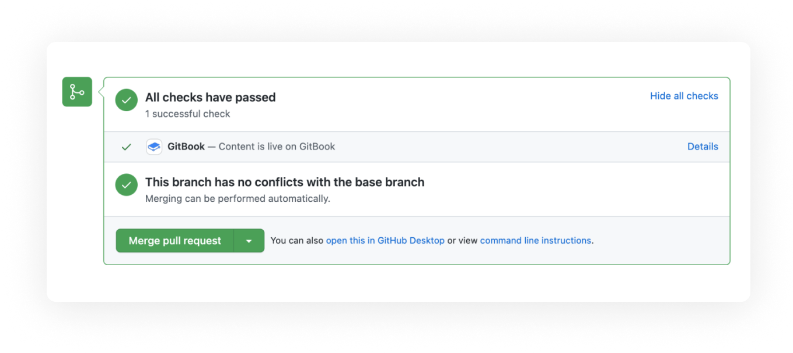

# Documentation Coding Style

## Where are the docs?

TL;DR version: [`docs`](https://github.com/StackExchange/dnscontrol/tree/main/docs) is the [marketing website](https://dnscontrol.org). [`documentation`](https://github.com/StackExchange/dnscontrol/tree/main/documentation) is the [docs.dnscontrol.org](https://docs.dnscontrol.org/) website. (Yes, the names are backwards!)

**The two websites**

1. <https://dnscontrol.org/>
   * The main website
   * Source code: [`docs`](https://github.com/StackExchange/dnscontrol/tree/main/docs)
   * Mostly "marketing" for the project.
   * Rarely changes.  Updated via GitHub "pages" feature.
2. <https://docs.dnscontrol.org/>
   * Project documentation
   * Source code: [`documentation`](https://github.com/StackExchange/dnscontrol/tree/main/documentation)
   * Users and developer documentation
   * Changes frequently.  Updated via [GitBook](https://www.gitbook.com/)

**The directory structure**

Within the git repo, docs are grouped:

* [`documentation/`](https://github.com/StackExchange/dnscontrol/tree/main/documentation): general docs
* [`documentation/providers/`](https://github.com/StackExchange/dnscontrol/tree/main/documentation/providers/): One file per provider
* [`documentation/language-reference/`](https://github.com/StackExchange/dnscontrol/tree/main/documentation/language-reference/): One file per `dnsconfig.js` language feature
* [`documentation/assets/FOO/`](https://github.com/StackExchange/dnscontrol/tree/main/documentation/assets/): Images for page FOO(PNGs only, please!)

## How to add a new page?

1. Add the page to the `documentation` folder (possibly a sub folder)
2. List the page in `SUMMARY.md` so that it will appear in the table of contents, sidebar, etc.

## Top-of-Document parameters

Files in the `documentation/language-reference/{record,domain,global}` subdirectories
have a header at the top that is used to populate other systems.

Here's an example from [`A`](language-reference/domain-modifiers/A.md)

```
---
name: A
provider: NAMEDOTCOM
parameters:
  - name
  - address
  - modifiers...
parameter_types:
  name: string
  address: string | number
  "modifiers...": RecordModifier[]
---
```

* `name`: The name of the function/constant in the document. This should match the filename (aside from the `.md` suffix).
* `parameters`: These are the names of the parameters that the function accepts. `modifiers...` indicates that a variable number of modifiers can be added.
* `parameter_types`: The typescript type for each parameter. This is used when generating `types-dnscontrol.d.ts`
* `provider`: If a feature is only available for one provider

## GitHub pull request preview

When you submit a GitHub pull request, you can view the result in advance. This allows you to check the impact of changes.



### How to access preview links

For every pull request, you’ll see a status added to the GitHub pull request with a unique preview URL. Clicking the **Details** link on the status will take you to the preview URL for your content. You can then make sure the content is as expected.


**NOTE**: A new preview URL is created for every git update. Please check the GitHub status for the most up to date URL.


## Formatting tips

### General

Break lines every 80 chars.

Include a blank line between paragraphs.

Leave exactly one blank line before and after a heading.

JavaScript code should use double quotes (`"`) for strings, not single quotes
(`'`).  They are equivalent but consistency is good.

### Headings

```markdown
#  Title of the page

## Heading

At least one paragraph.

## Subheadings

At least one paragraph.

* **Step 1: Foo**

Description of the step.

* **Step 2: Bar**

Description of the step.

(further sub sub headings are discouraged encouraged)
```

### Code Snippets

See the examples below, for the Markdown syntax click on the 'Source code'.

Long example: (with filename)


```javascript
var REG_NONE = NewRegistrar("none");
var DNS_BIND = NewDnsProvider("bind");

D("example.com", REG_NONE, DnsProvider(DNS_BIND),
    A("@", "1.2.3.4")
);
```


[Source code](markdown-examples/code/dnsconfig-code-example-with-filename.md?plain=1)

Long example: (without filename)


```javascript
var REG_NONE = NewRegistrar("none");
var DNS_BIND = NewDnsProvider("bind");

D("example.com", REG_NONE, DnsProvider(DNS_BIND),
    A("@", "1.2.3.4")
);
```


[Source code](markdown-examples/code/dnsconfig-code-example-without-filename.md?plain=1)

### Hint

Hints are a great way to bring the reader's attention to specific elements in your documentation.

There are 4 different types of hints, and both inline content and formatting are supported.

### Example of a hint


**Info hints** are great for showing general information, or providing tips and tricks.


 [Source code](markdown-examples/hint/hint-info.md?plain=1)


**Success hints** are good for showing positive actions or achievements.


 [Source code](markdown-examples/hint/hint-success.md?plain=1)


**Warning hints** are good for showing important information or non-critical warnings.


 [Source code](markdown-examples/hint/hint-warning.md?plain=1)


**Danger hints** are good for highlighting destructive actions or raising attention to critical information.


 [Source code](markdown-examples/hint/hint-danger.md?plain=1)


### This is a heading

This is a line

This is a second <mark style="color:white;background-color:green;">line</mark>


### Technical references

#### Mentioning language features

Not every mention to A, CNAME, or function
needs to be a link to the manual for that record type.
However, the first mention on a page should always
be a link.  Others are at the authors digression.

```markdown
The [`PTR`](language-reference/domain-modifiers/PTR.md) feature is helpful in LANs.
```

#### Mentioning functions from the Source code

```markdown
The function `GetRegistrarCorrections()` returns...
```

### Links

#### Internal links

```markdown
Blah blah blah [M365_BUILDER](language-reference/domain-modifiers/M365_BUILDER.md)
```


**NOTE**: The `.md` is required.


#### Link to another website

Just list the URL.

```markdown
Blah blah blah <https://www.google.com> blah blah.
```

#### Link with anchor text

```markdown
Blah blah blah [a search engine](https://www.google.com) blah blah.
```

## Capitalization matters

Please capitalize these terms as you see them here:

  * DNSControl
  * GitHub

## Proofreading

Please spellcheck documents before submitting a PR.

Don't be surprised if Tom rewrites your text.  He often does that to keep the
documentation consistent and make it more approachable by new users.  It's not
[because he has a big ego](https://www.amazon.com/stores/author/B004J0QIVM).
Well, not usually.
